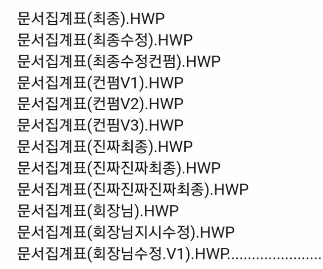
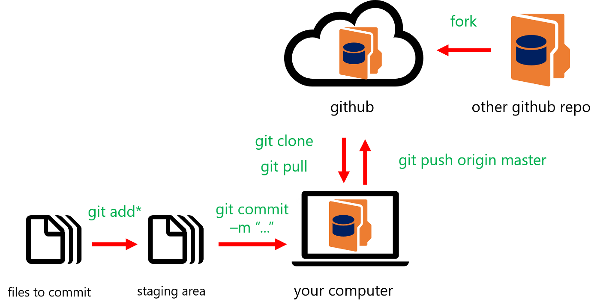
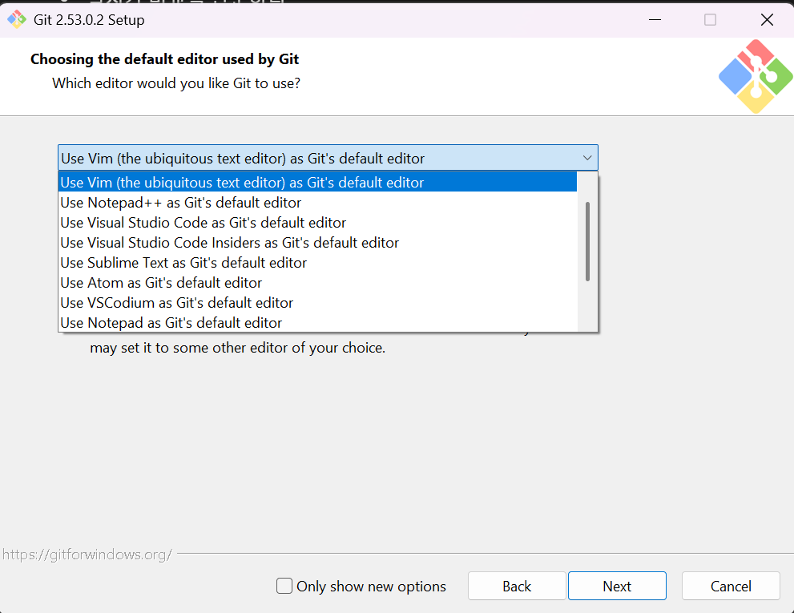
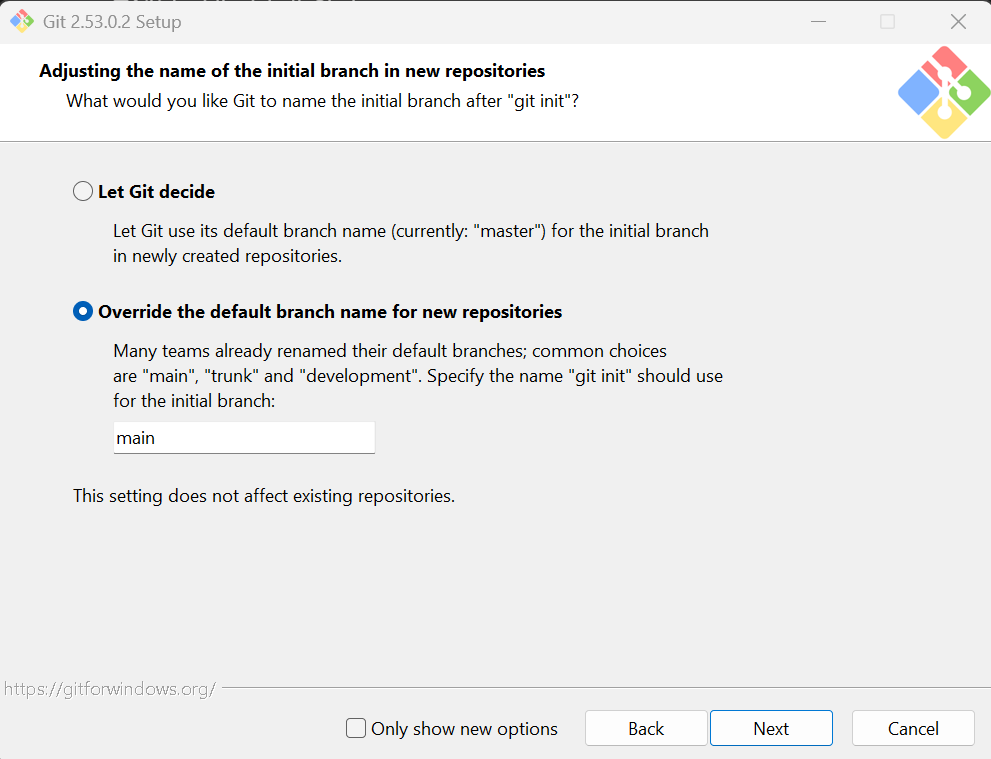
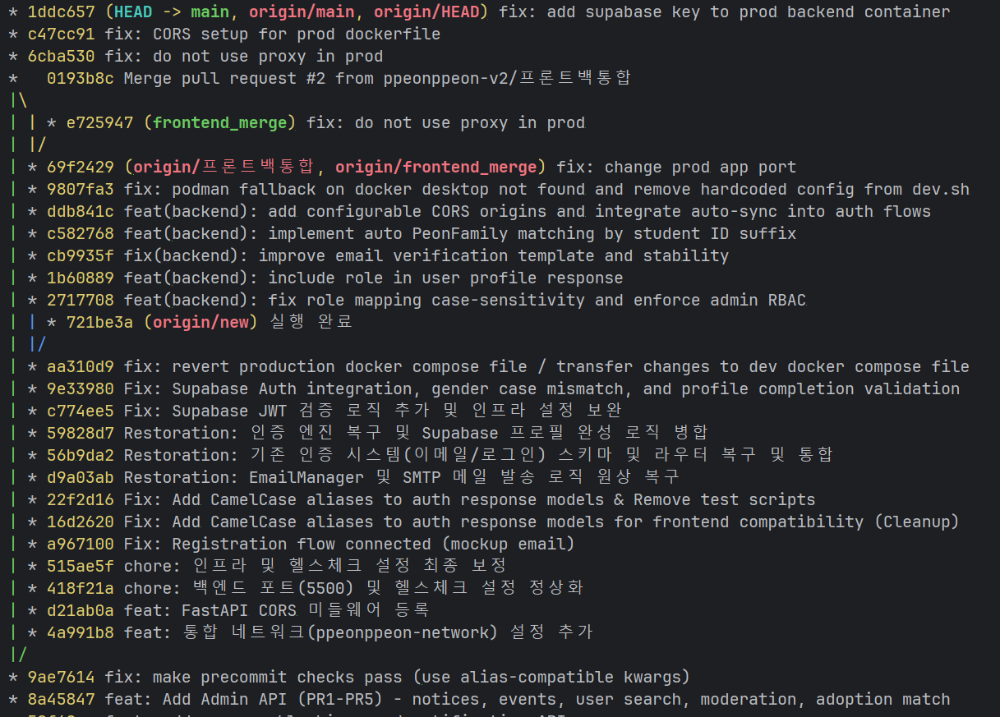
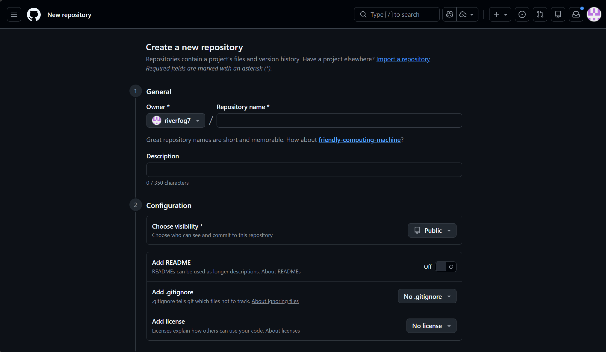

# 1주차

## 목표
- [ ] Git과 Bash 환경을 설치하였다.
- [ ] Git이 왜 필요한지 설명할 수 있다.
- [ ] Git과 GitHub의 차이를 설명할 수 있다.
- [ ] Git Bash에서 Git 기초 명령어를 사용할 수 있다.
- [ ] Git 저장소를 만들고 첫 커밋을 할 수 있다.
- [ ] Git 커밋 기록을 확인할 수 있다.

## 목차
1. 왜 Git이 필요한가?
2. Git과 GitHub는 무엇이 다른가?
3. 왜 Git Bash를 사용하는가? (Windows 기준)
4. Git 설치와 GitHub 로그인
5. Git 기본 설정
6. 첫 저장소(Repository) 만들기
7. 커밋 하기
8. Git 커밋 기록 확인하기
9. GitHub 웹에서 저장소 만들어보기


## 1. 왜 Git이 필요한가?
개발을 하다 보면 파일이 계속 바뀐다.



Git은 이런 변경 이력을 기록하고 관리할 수 있게 해주는 도구이다.

## 2. Git? GitHub?
- Git: 버전 관리 시스템
- GitHub: Git 저장소를 호스팅하는 웹 서비스

> Git을 동영상이라 생각하면, GitHub는 그 동영상을 저장하는 유튜브 같은 서비스라고 볼 수 있다.



## 3. 왜 Git Bash를 사용하는가? (Windows 기준)
- 설치가 비교적 쉽다 (Git을 설치하면 함께 설치됨)
- Unix-like 환경을 제공한다. (Linux/MacOS와 유사한 명령어 사용 가능)
- WSL은 완전한 Linux 환경이지만 설치 및 설정이 복잡하여 이 강의에서는 Git Bash를 사용한다.

## 4. Git 설치와 GitHub 계정 준비
### 4.1 Git 설치
[Git 공식 웹사이트](https://git-scm.com/install/windows)에 접속해 Git을 다운로드하고 설치한다.  
WSL을 사용할 경우에는 OS의 패키지 매니저를 활용해 Git을 설치할 수 있다: `sudo apt install git`

#### 설치 FAQ
##### 1. 기본 에디터는 무엇으로 해야 하나요?


기본값인 vim은 사용하기 어렵기 때문에 자신이 자주 쓰는 에디터 (VSCode)로 설정하는 것을 추천한다.

##### 2. Branch 이름 기본값은 무엇으로 해야 하나요?


기본 값인 master는 과거에 인종차별적 의미가 담긴 단어로 여겨져 main으로 변경되어가고 있다.  
GitHub의 기본값이 main이므로 main으로 설정하는 것을 추천한다.

##### 3. 나머지 설정은 어떻게 하면 되나요?

기본 설정으로 진행해도 됩니다.

---
### 4.2. Git이 설치되었는지 확인하기
Git이 제대로 설치되었는지 확인하기 위해 Git Bash를 열고 다음 명령어를 입력해보자.
```bash
git --version
```

이 명령어를 실행하면 설치된 Git의 버전이 출력될 것이다.  
예시 출력: `git version 2.30.0`

---

### 4.3 GitHub 계정 준비
오늘은 GitHub 계정에 로그인만 해두면 충분하다. GitHub에 계정이 없다면 [GitHub 공식 웹사이트](https://github.com)에 접속해 계정을 만들어보자.

---

### 4.4 GitHub Student Developer Pack
[GitHub Student Developer Pack](https://education.github.com/pack)은 학생들에게 무료로 제공되는 다양한 개발 도구와 서비스에 대한 액세스를 제공하는 프로그램이다.

Student Developer Pack의 대표적인 혜택으로는 다음과 같은 것들이 있다:
- 무료 GitHub Pro 계정: GitHub의 고급 기능을 사용할 수 있는 Pro 계정을 무료로 제공한다.
- Jetbrains 제품 무료 이용
- Gitkraken, Termius 등 개발 도구 무료 이용

재학증명서나 학생증, 그리고 학교 이메일 주소가 필요하지만 무료 혜택이 많으니 꼭 신청해보자.

## 5. Git 기본 설정
> `git config` 명령어를 사용하여 Git의 설정을 변경할 수 있다.  
> `--global` 옵션을 사용하면 모든 저장소에 적용되는 전역 설정이 된다.

Git을 사용하기 전에 Git에게 사용자 이메일과 이름을 알려줘야 한다.  
이 정보는 수정 기록에 포함되어 다른 사람들이 누가 어떤 변경을 했는지 알 수 있게 해준다.  
다음 명령어를 Git Bash에 입력하여 Git을 설정해보자.

```bash
git config --global user.name "홍길동"
git config --global user.email "gildong@example.com"
git config --global init.defaultBranch main # 기본 브랜치 이름을 main으로 설정 / GitHub의 기본값
git config --global --list
```

## 6. 첫 저장소(Repository) 만들기
> `git init`은 현재 폴더를 Git 저장소로 만들어준다.

Git 저장소는 Git이 파일의 변경 이력을 추적할 수 있도록 하는 공간이다.  
이제 실습용 폴더를 만들고 Git 저장소를 설정해보자.

```bash
mkdir git-practice-week1
cd git-practice-week1
git init
git status
```

- mkdir: 디렉토리(폴더) 만들기
- cd \<dir>: \<dir> 디렉토리로 이동하기
- git init: 현재 디렉토리를 Git 저장소로 초기화하기
- git status: 현재 저장소의 상태 확인하기 (추적되지 않은 파일, 변경된 파일 등)

`git status` 명령어를 실행하면 "nothing to commit, working tree clean"이라는 메시지가 보일 것이다.  
이는 저장소가 성공적으로 만들어졌으며, 현재 저장소에 변경된 파일이 없고, Git이 추적하는 파일이 없다는 것을 의미한다.


## 7. 첫 번째 커밋 만들기
### 7.1. README.md 파일 만들기
> `README.md` 파일은 프로젝트에 대한 설명을 담는 파일로, 보통 마크다운(Markdown) 형식으로 작성된다.

README.md 파일을 만들어보자. 여기서는 cli를 활용해서 파일을 작성하지만 VSCode나 메모장 등 텍스트 에디터로 작성해도 된다.

```bash
touch README.md
echo "# Git Practice Week1" > README.md # code README.md를 사용해서 VSCode에서 파일을 바로 열 수도 있다.
cat README.md
git status
```

- touch: 새로운 파일 만들기
- echo: 텍스트를 출력하기 (여기서는 README.md 파일에 "# Git Practice Week1"이라는 텍스트를 작성하는 데 사용됨)
- cat: 파일의 내용을 출력하기
- git status: 현재 저장소의 상태 확인하기 (README.md 파일이 추적되지 않은 파일로 나타날 것이다)

이제 `git status`의 출력에서 README.md 파일이 "Untracked files" 섹션에 나타나는 것을 볼 수 있다.  
이는 Git이 README.md 파일이 새로 생긴 것을 확인했지만 아직 추적하고 있지 않다는 것을 의미한다.

### 7.2. git add와 git commit

#### git add
> `git add <file>`
- Git에게 파일을 staging area에 추가하라고 지시하는 명령어이다.
- Staging area는 커밋할 파일을 임시로 보관하는 공간이다

#### git commit
> `git commit -m "커밋 메시지"`
- Staging area에 있는 변경 사항들을 하나의 체크포인트로 저장하는 명령어이다.
- 이 체크포인트를 커밋(commit)이라고 부른다.
- 커밋 메시지는 변경 사항에 대한 설명을 담는 텍스트로, 다른 사람들이 변경 사항을 이해하는 데 도움이 된다.

이제 README.md 파일을 staging area에 추가하고 커밋해보자.

```bash
git add README.md
git status
git commit -m "Add README.md file"
git status
```

`git add`를 수행하고 난 후 `git status`를 실행하면 README.md 파일이 "Changes to be committed" 섹션에 나타나는 것을 볼 수 있다.  
이는 Git이 README.md 파일이 staging area에 추가되었음을 확인했다는 것을 의미한다.  
`git commit`을 수행하고 난 후 `git status`를 실행하면 "nothing to commit, working tree clean"이라는 메시지가 다시 나타나는 것을 볼 수 있다.

이제 배운 내용을 바탕으로 자유롭게 파일을 추가하고 2번 이상 커밋해보자.

## 8. Git 커밋 기록 확인하기
> `git log` 명령어를 사용해 커밋 기록을 확인할 수 있다.
> `--oneline` 옵션을 사용하면 각 커밋이 한 줄로 요약되어 보여진다.
> `--graph` 옵션을 사용하면 커밋 간의 관계를 그래프로 보여준다.
> `--all` 옵션을 사용하면 모든 브랜치의 커밋 기록을 보여준다.

`git log` 명령어를 사용해서 커밋 기록을 확인해보자.

```bash
git log
```

지금은 커밋이 많지 않아 `git log`의 기본 출력도 읽기 쉽지만 커밋이 많아지만 `--oneline` 옵션을 사용해서 간략하게 출력하는 것을 추천한다.

```bash
git log --oneline
```

다양한 옵션을 조합하면 다음 사진과 같이 복잡한 커밋 기록도 쉽게 확인할 수 있다.



## 9. 정리 및 과제 안내
[Github 웹사이트](https://github.com)에 접속해서 새 저장소를 만들어보자.  
이 저장소와 지금까지 만든 저장소를 연동하는 방법은 추후 강의에서 다룰 예정이다.



## 10. 과제
없음

## 11. 선택 과제
- GitHub Student Developer Pack 신청하기
