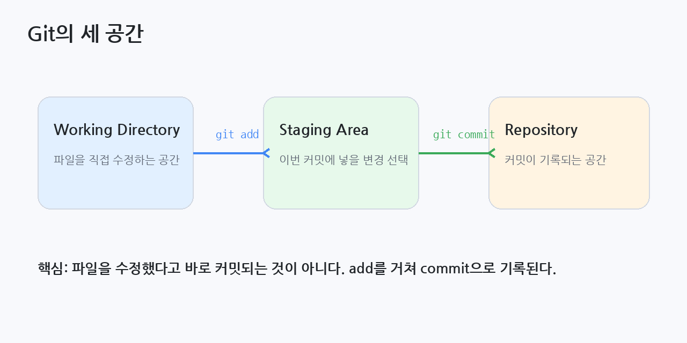
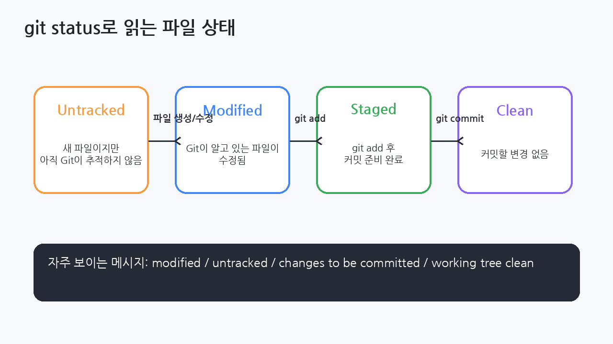
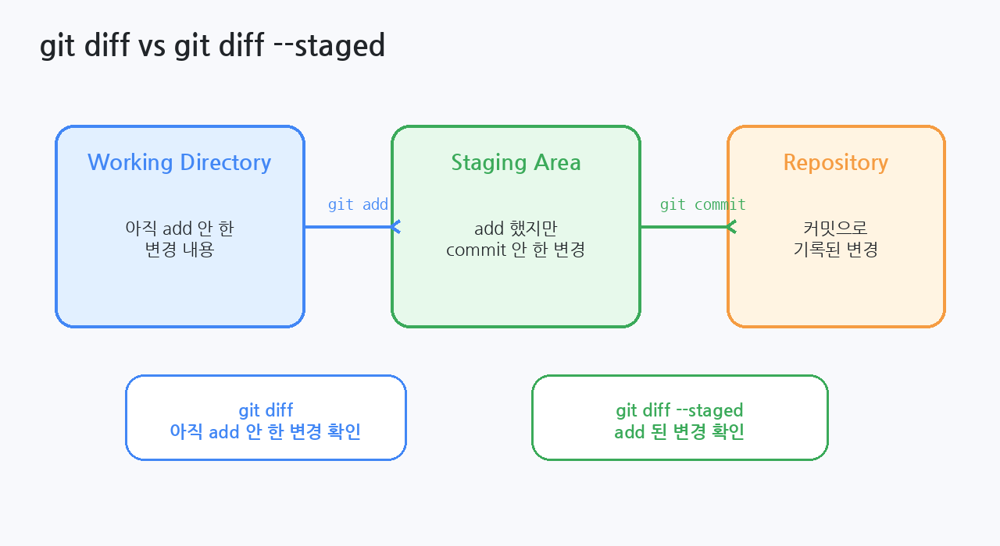
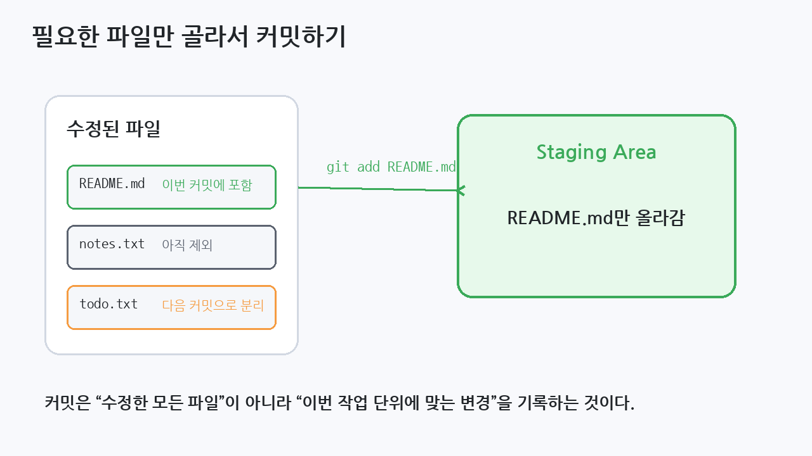
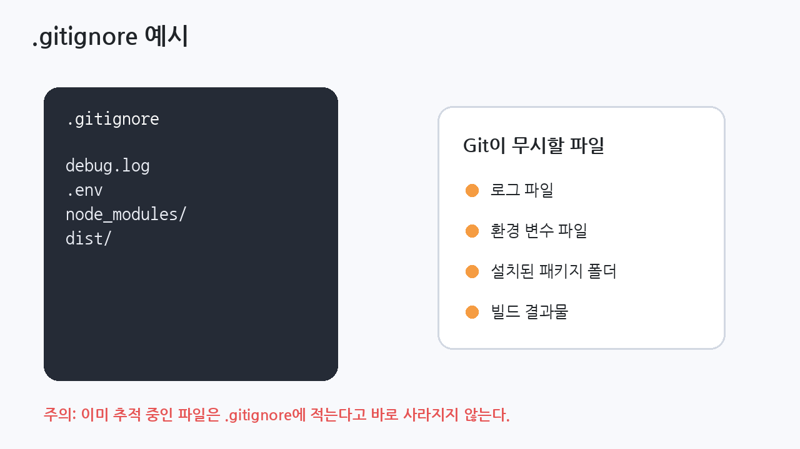
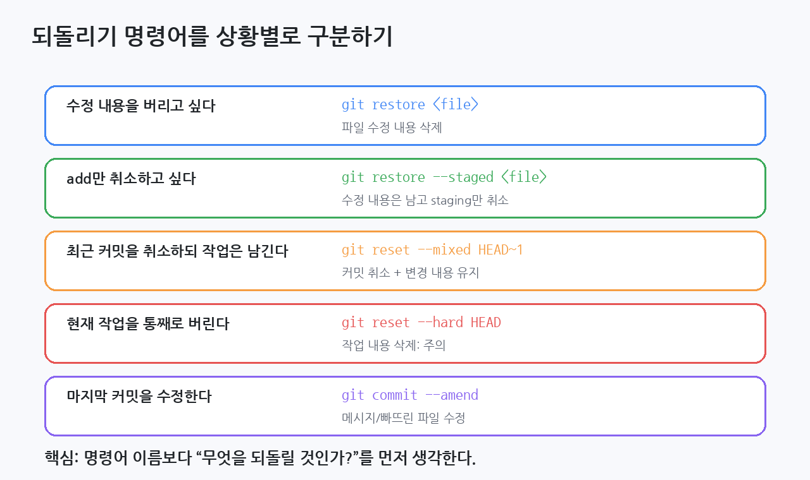

# 2주차

## 목표
- [ ] `git status`를 보고 현재 저장소 상태를 읽을 수 있다.
- [ ] Working Directory, Staging Area, Repository의 차이를 설명할 수 있다.
- [ ] `git diff`와 `git diff --staged`를 사용해 변경 내용을 확인할 수 있다.
- [ ] 수정한 파일 중 필요한 파일만 골라서 staging하고 commit할 수 있다.
- [ ] `.gitignore`로 Git이 추적하지 않을 파일을 지정할 수 있다.
- [ ] `restore`, `reset`, `amend`를 상황에 맞게 사용할 수 있다.

## 목차
1. 1주차 복습과 2주차 흐름
2. Git의 세 공간과 `git status`
3. `git diff`로 변경 내용 확인하기
4. 필요한 파일만 골라서 커밋하기
5. `.gitignore`
6. 되돌리기: `restore`, `reset`, `amend`
7. 정리 및 과제 안내

---

## 1. 1주차 복습과 2주차 흐름
1주차에는 Git 저장소를 만들고 첫 커밋을 만들어보았다.

```bash
git init
git status
git add README.md
git commit -m "Add README.md file"
git log --oneline
```

1주차의 핵심이 **Git을 한 번 써보는 것**이었다면, 2주차의 핵심은 **커밋하기 전에 상태를 읽고 정리하는 것**이다.

오늘은 다음 흐름을 반복해서 연습한다.

> 수정한다 → `status`로 상태를 본다 → `diff`로 내용을 본다 → 필요한 것만 `add`한다 → `commit`한다 → 실수하면 `restore`, `reset`, `amend`로 정리한다.

---

## 2. Git의 세 공간과 `git status`
Git을 이해하려면 다음 세 공간을 구분해야 한다.



### 2.1 Working Directory
실제로 파일을 수정하는 공간이다. 우리가 VSCode, 메모장, 터미널에서 파일을 바꾸는 곳이다.

### 2.2 Staging Area
이번 커밋에 포함할 변경 사항을 임시로 올려두는 공간이다. `git add`를 하면 변경 사항이 Staging Area로 올라간다.

### 2.3 Repository
커밋이 저장되는 공간이다. `git commit`을 하면 Staging Area에 올라간 변경 사항이 Repository에 하나의 기록으로 저장된다.

---

### 2.4 실습 준비
오늘 실습은 상태 변화를 명확하게 보기 위해 새 저장소에서 진행한다.

```bash
mkdir git-practice-week2
cd git-practice-week2
git init

echo "# Git Practice Week2" > README.md
echo "Week2 practice notes" > notes.txt

git add README.md notes.txt
git commit -m "Prepare week2 practice"

git status
```

`git status` 결과가 `nothing to commit, working tree clean`이면 준비가 끝난 상태이다.

---

### 2.5 `git status` 제대로 읽기
> `git status`는 현재 저장소의 상태를 알려주는 명령어이다.

Git을 사용하다가 헷갈리면 가장 먼저 볼 명령어는 `git status`이다.

```bash
git status
```

`git status`로 다음 내용을 확인할 수 있다.

- 어떤 파일이 수정되었는지
- 어떤 파일이 아직 추적되지 않는지
- 어떤 파일이 staging 되었는지
- 커밋할 것이 있는지



### 상태를 일부러 만들어보기
파일을 수정하고 새 파일도 만들어보자.

```bash
echo "" >> README.md
echo "## Week2" >> README.md
echo "todo item" > todo.txt

git status
```

이때 `README.md`는 수정된 파일로 보이고, `todo.txt`는 아직 Git이 추적하지 않는 파일로 보일 것이다.

### 자주 보게 되는 상태
- `modified`: Git이 추적 중인 파일이 수정됨
- `untracked`: 새로 생겼지만 Git이 아직 추적하지 않음
- `changes to be committed`: staging 되어 커밋 준비가 됨
- `nothing to commit, working tree clean`: 현재 작업 내용이 깨끗함

### 현재 상태
- `README.md`는 수정된 파일로 보인다.
- `todo.txt`는 untracked 파일로 보인다.
- 아직 아무것도 commit하지 않았다.

---

## 3. `git diff`로 변경 내용 확인하기
`git status`는 어떤 파일이 바뀌었는지 알려준다.  
하지만 **파일 안에서 정확히 무엇이 바뀌었는지**까지는 자세히 보여주지 않는다. 이때 `git diff`를 사용한다.

### 3.1 아직 staging 하지 않은 변경 보기
> `git diff`는 아직 `git add` 하지 않은 변경 내용을 보여준다.

```bash
git diff
```

이 명령어를 실행하면 `README.md` 안에서 어떤 줄이 추가되었는지 확인할 수 있다.

### 3.2 특정 파일의 변경만 보기
파일이 많을 때는 특정 파일만 지정해서 보는 것이 더 편하다.

```bash
git diff README.md
```

---

### 3.3 staging 된 변경 보기
이제 `README.md`만 staging 해보자.

```bash
git add README.md
git status
```

이 상태에서 다시 diff를 확인한다.

```bash
git diff
git diff --staged
```



> `git diff`가 비어 있다고 해서 변경 사항이 없는 것은 아니다. 이미 staging 되었을 수 있으므로 `git diff --staged`도 확인해보자.

- `README.md`는 staging 되어 있다.
- `todo.txt`는 아직 untracked 상태이다.
- `git diff --staged`에서 `README.md` 변경 내용이 보인다.

---

## 4. 필요한 파일만 골라서 커밋하기
많이 하는 실수 중 하나는 아무 생각 없이 `git add .`를 입력하는 것이다.

`git add .`이 항상 나쁜 것은 아니다. 하지만 처음에는 **무엇이 커밋되는지 알고 add하는 습관**이 더 중요하다.

### 4.1 현재 상태 확인
```bash
git status
```

현재는 `README.md`만 staging 되어 있고, `todo.txt`는 아직 untracked 상태일 수 있다.

### 4.2 README.md만 커밋하기
```bash
git commit -m "Update README for week2"
```

이 커밋에는 `README.md` 변경만 포함된다.  
`todo.txt`는 아직 커밋되지 않는다.



### 왜 중요할까?
커밋은 “수정한 모든 파일을 한 번에 저장”하는 것이 아니라, **이번 작업 단위에 맞는 변경만 기록하는 것**이다.

예를 들어 다음 두 작업은 가능하면 다른 커밋으로 나누는 것이 좋다.

- README 설명 수정
- 새로운 todo 파일 추가

### 4.3 todo.txt도 따로 커밋하기
```bash
git add todo.txt
git commit -m "Add todo file"
```

### 여기까지 확인
```bash
git status
git log --oneline
```

- 작업 트리가 깨끗한 상태인지 확인한다.
- 방금 만든 커밋 2개가 보이는지 확인한다.

---

## 5. `.gitignore`
모든 파일을 Git으로 관리해야 하는 것은 아니다.

보통 다음과 같은 파일은 Git에 올리지 않는다.

- 로그 파일 (.log, .err)
- 임시 파일 (.tmp)
- 빌드 결과물 (dist/, build/)
- 개인 환경 설정 파일 (.vscode/, .idea/)
- 비밀번호, API Key 같은 민감한 정보가 들어 있는 파일 (.env)

이럴 때 `.gitignore` 파일을 사용한다.



### 5.1 Git이 무시할 파일 만들기
```bash
echo "temporary debug message" > debug.log
echo "SECRET_KEY=myverysecretkey" > .env

git status
```

이 상태에서는 `debug.log`, `.env`가 Git에 보일 수 있다.

### 5.2 `.gitignore` 만들기
```bash
echo "debug.log" > .gitignore
echo ".env" >> .gitignore

git status
```

이제 `debug.log`, `.env`는 Git이 무시한다.

### 5.3 `.gitignore` 커밋하기
```bash
git add .gitignore
git commit -m "Add gitignore"
```

### 주의할 점
이미 Git이 추적 중인 파일은 `.gitignore`에 적는다고 바로 사라지지 않는다.  
`.gitignore`는 가능하면 파일을 추적하기 전에 미리 작성하는 것이 좋다.

---

## 6. 되돌리기: `restore`, `reset`, `amend`
이제 실수했을 때 변경을 되돌리는 방법을 배워보자.

- 수정한 내용을 버리고 싶다 → `git restore`
- staging만 취소하고 싶다 → `git restore --staged`
- 최근 커밋은 취소하고 변경 내용은 남기고 싶다 → `git reset --mixed`
- 현재 작업을 마지막 커밋 상태로 되돌리고 싶다 → `git reset --hard`
- 마지막 커밋을 수정하고 싶다 → `git commit --amend`



---

### 6.1 수정한 내용을 버리기: `git restore`
> `git restore <file>`은 아직 commit하지 않은 파일 수정 내용을 버린다.

README.md에 잘못된 내용을 추가해보자.

```bash
echo "wrong change" >> README.md

git status
git diff
```

수정 내용을 버리고 마지막 커밋 상태로 돌아가려면 다음 명령어를 사용한다.

```bash
git restore README.md

git status
```

`README.md`의 방금 수정한 내용이 사라진다.

---

### 6.2 staging만 취소하기: `git restore --staged`
> `git restore --staged <file>`은 `git add`만 취소한다.

이번에는 `notes.txt`를 수정하고 staging까지 해보자.

```bash
echo "staged change" >> notes.txt

git add notes.txt
git status
```

staging만 취소하려면 다음 명령어를 사용한다.

```bash
git restore --staged notes.txt

git status
```

이 명령은 `git add`만 취소한다. 파일의 수정 내용은 그대로 남아 있다.

실습 흐름을 깔끔하게 이어가기 위해, 남아 있는 수정 내용도 다시 되돌린다.

```bash
git restore notes.txt
git status
```

### 한 줄 요약
- `git restore <file>`: 파일 수정 내용을 버림
- `git restore --staged <file>`: staging만 취소함

---

### 6.3 `git reset --mixed`: 커밋은 취소하고 변경 내용은 남기기
> `git reset --mixed HEAD~1`은 최근 커밋은 취소하지만, 파일 수정 내용은 남긴다.

먼저 reset 실습용 파일을 하나 만들고 커밋한다.

```bash
echo "reset practice" > reset-demo.txt

git add reset-demo.txt
git commit -m "Add reset demo file"
git log --oneline
```

방금 만든 커밋을 취소하되, 파일 수정 내용은 남겨보자.

```bash
git reset --mixed HEAD~1

git status
```

### 결과
- 마지막 커밋은 취소된다.
- 하지만 `reset-demo.txt`는 Working Directory에 남아 있다.
- 다시 `git add`, `git commit`을 할 수 있다.

실습 흐름을 이어가기 위해 다시 커밋한다.

```bash
git add reset-demo.txt
git commit -m "Add reset demo file"
```

---

### 6.4 `git reset --hard`: 작업 내용을 마지막 커밋 상태로 되돌리기
> `git reset --hard HEAD`는 현재 작업 내용을 마지막 커밋 상태로 되돌린다.

이번에는 `reset-demo.txt`를 다시 수정한다.

```bash
echo "broken change" >> reset-demo.txt

git status
git diff reset-demo.txt
```

현재 작업 내용을 모두 버리고 마지막 커밋 상태로 돌아가보자.

```bash
git reset --hard HEAD

git status
```

### 결과
- Git이 추적 중인 파일의 수정 내용이 사라진다.
- 마지막 커밋 상태로 돌아간다.

> 주의: `git reset --hard`는 작업 내용을 날릴 수 있다. 실습용 저장소나 정말 버려도 되는 변경에만 사용하자.  
> 새로 만든 untracked 파일은 상황에 따라 남아 있을 수 있다.

---

### 6.5 `git commit --amend`: 마지막 커밋 수정하기
> `git commit --amend`는 마지막 커밋을 수정할 때 사용한다.

예를 들어 다음과 같은 상황에서 쓴다.

- 방금 커밋했는데 메시지를 잘못 적었다.
- 방금 커밋했는데 파일 하나를 빠뜨렸다.

### 마지막 커밋 메시지 수정하기
새 커밋을 하나 만들어보자.

```bash
echo "amend practice" >> notes.txt

git add notes.txt
git commit -m "Update note"
```

메시지를 더 자연스럽게 바꿔보자.

```bash
git commit --amend -m "Update notes"

git log --oneline
```

### 빠뜨린 파일을 마지막 커밋에 추가하기
방금 커밋에 파일 하나를 빠뜨렸다고 가정해보자.

```bash
echo "extra memo" > memo.txt

git add memo.txt
git commit --amend --no-edit

git log --oneline
```

`--no-edit`은 커밋 메시지는 그대로 두고, staging 된 변경만 마지막 커밋에 합친다는 뜻이다.

### 주의할 점
`git commit --amend`는 **마지막 커밋만 수정**한다.  
오래된 커밋 여러 개를 정리하는 방법은 뒤에서 `rebase -i`를 배울 때 다룬다.

---

## 7. 정리 및 과제 안내
오늘 배운 내용은 “커밋을 더 잘하기 위한 준비 과정”이다.

꼭 기억해야 할 것은 다음과 같다.

1. 헷갈릴 때는 먼저 `git status`를 본다.
2. `git diff`는 아직 add 안 한 변경을 보여준다.
3. `git diff --staged`는 add 했지만 commit 안 한 변경을 보여준다.
4. `git add .`를 쓰기 전에 무엇이 들어가는지 확인한다.
5. `.gitignore`로 Git이 무시할 파일을 지정할 수 있다.
6. `git restore`는 수정 내용을 버릴 때 쓴다.
7. `git restore --staged`는 add만 취소할 때 쓴다.
8. `git reset --mixed`는 커밋은 취소하고 변경 내용은 남긴다.
9. `git reset --hard`는 작업 내용을 버릴 수 있으므로 조심해야 한다.
10. `git commit --amend`는 마지막 커밋을 수정할 때 쓴다.

---

## 8. 명령어 요약
```bash
git status
git diff
git diff --staged

git add README.md
git add .

git restore README.md
git restore --staged README.md

git reset --mixed HEAD~1
git reset --hard HEAD

git commit --amend -m "New commit message"
git commit --amend --no-edit
```

### 짧은 용도 정리
- `git status`: 현재 상태 확인
- `git diff`: 아직 staging 안 된 변경 확인
- `git diff --staged`: staging 된 변경 확인
- `git add <file>`: 특정 파일만 staging
- `git restore <file>`: 수정 내용 버리기
- `git restore --staged <file>`: staging 취소
- `git reset --mixed HEAD~1`: 마지막 커밋 취소, 변경 내용은 유지
- `git reset --hard HEAD`: 현재 작업 내용을 마지막 커밋 상태로 되돌림
- `git commit --amend`: 마지막 커밋 수정

---

## 9. 과제
### 과제 1
새 저장소를 만들고 파일 2개 이상을 수정한 뒤 `git status`, `git diff`를 확인해보자.

### 과제 2
수정한 파일 중 하나만 골라서 staging하고 커밋해보자.

### 과제 3
`.gitignore` 파일을 만들고 `debug.log`, `.env`를 무시하도록 설정해보자.

### 과제 4
아래 명령어를 각각 한 번 이상 실습해보고, 언제 쓰는지 한 줄로 정리해보자.

- `git restore`
- `git restore --staged`
- `git reset --mixed`
- `git reset --hard`
- `git commit --amend`
