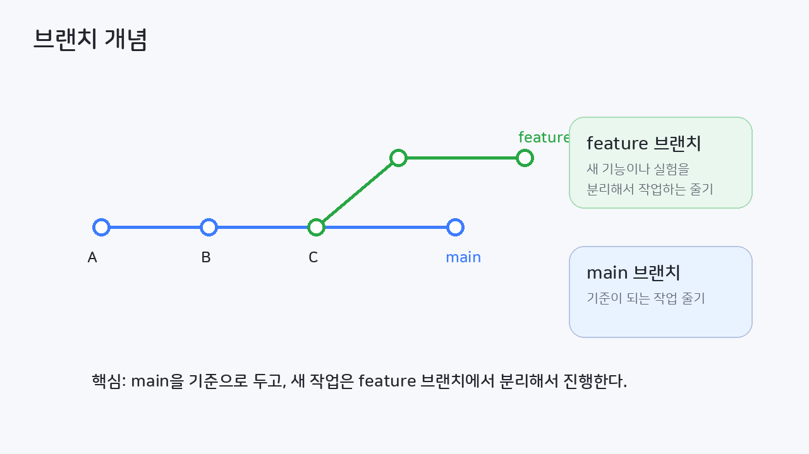
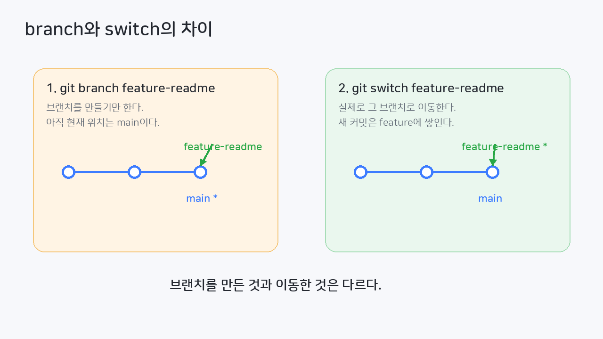
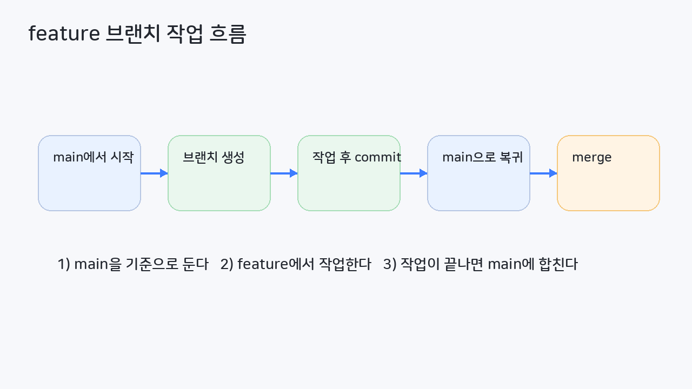
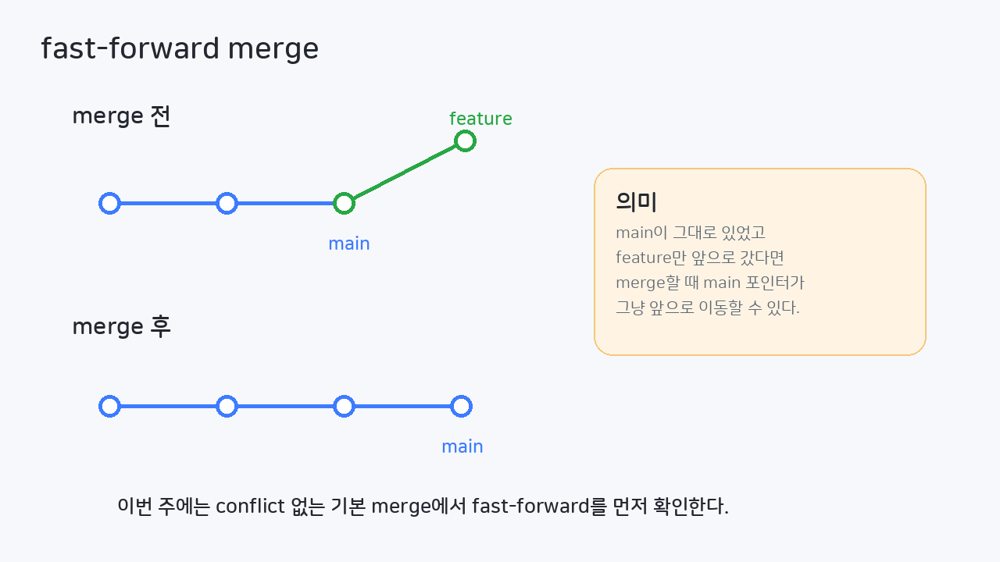
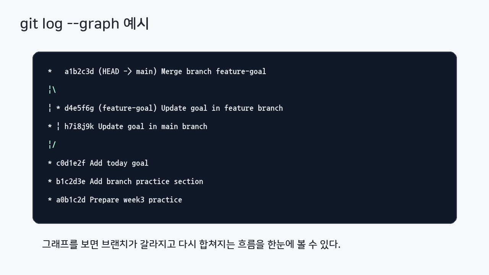
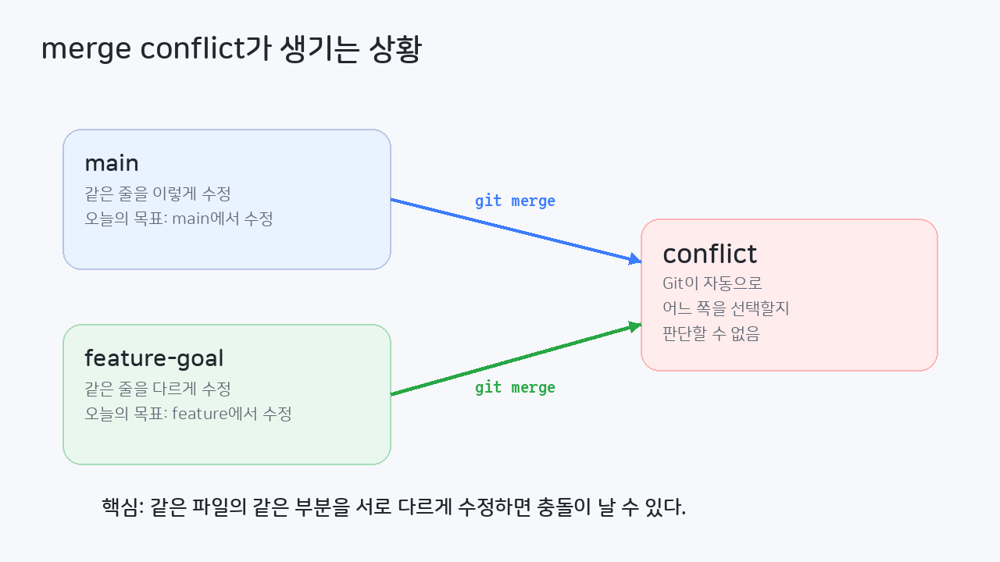
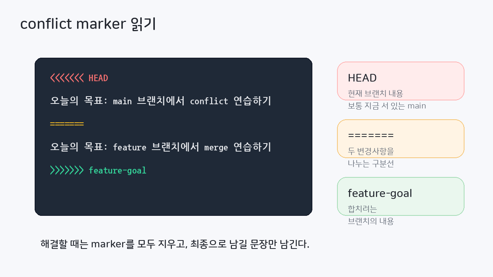
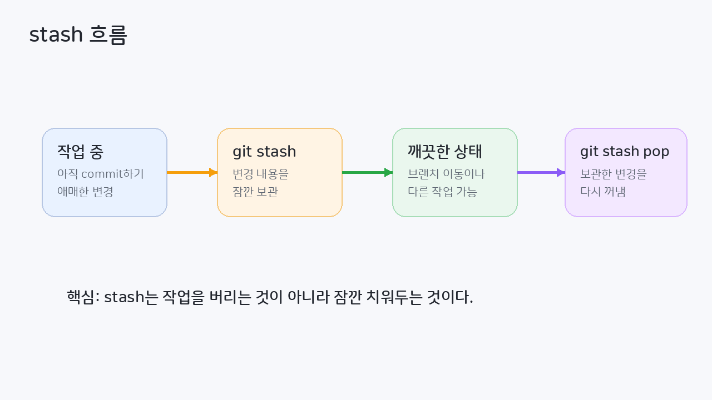

# 3주차

## 목표
- [ ] 브랜치를 왜 사용하는지 설명할 수 있다.
- [ ] `git branch`, `git switch`를 사용해 브랜치를 만들고 이동할 수 있다.
- [ ] feature 브랜치에서 작업하고 `main`에 merge할 수 있다.
- [ ] `git log --graph --oneline --decorate --all`로 브랜치 흐름을 확인할 수 있다.
- [ ] merge conflict가 왜 생기는지 이해하고 직접 해결할 수 있다.
- [ ] `git merge --abort`로 merge를 취소할 수 있다.
- [ ] `git stash`, `git stash list`, `git stash pop`으로 작업 중인 변경을 잠깐 치워둘 수 있다.

## 목차
1. 2주차 복습과 3주차 흐름
2. 왜 브랜치를 쓰는가?
3. 브랜치 만들기와 이동하기
4. feature 브랜치에서 작업하고 merge하기
5. merge conflict 만들기
6. merge conflict 해결하기
7. 브랜치 흐름 확인과 브랜치 정리
8. stash로 작업 잠깐 치워두기
9. 정리 및 과제 안내

---

## 1. 2주차 복습과 3주차 흐름
2주차에는 커밋하기 전에 상태를 읽고, 필요한 변경만 골라서 커밋하는 법을 배웠다.

```bash
git status
git diff
git diff --staged
git add README.md
git commit -m "Update README"
git restore README.md
git reset --hard HEAD
```

2주차의 핵심이 **변경사항을 읽고 정리하는 것**이었다면, 3주차의 핵심은 **작업을 브랜치로 나누고 다시 합치는 것**이다.

오늘은 다음 흐름을 연습한다.

> 브랜치를 만든다 → 브랜치에서 작업한다 → `main`에 merge한다 → conflict가 나면 해결한다 → 작업 중인 변경은 stash로 잠깐 치워둔다.

---

## 2. 왜 브랜치를 쓰는가?
브랜치를 쓰는 가장 큰 이유는 **기존 작업을 망치지 않고 새 작업을 분리해서 할 수 있기 때문**이다.

예를 들어 다음과 같은 상황을 생각해보자.

- `main`에는 지금까지 잘 동작하는 코드가 있다.
- 새로운 기능을 만들고 싶다.
- 그런데 새 기능을 만들다가 실수할 수도 있다.
- 아직 완성되지 않은 작업을 `main`에 바로 섞고 싶지는 않다.

이럴 때 새 브랜치를 만들어 작업하면 된다.



- `main`: 기준이 되는 작업 줄기
- `feature 브랜치`: 새 기능이나 실험을 분리해서 진행하는 작업 줄기


---

### 2.1 오늘 실습 준비
오늘은 브랜치와 conflict를 명확하게 보기 위해 새 저장소에서 진행한다.

```bash
mkdir git-practice-week3
cd git-practice-week3
git init

echo "# Git Practice Week3" > README.md
echo "" >> README.md
echo "오늘의 목표: 브랜치 이해하기" >> README.md
echo "Week3 practice notes" > notes.txt

git add README.md notes.txt
git commit -m "Prepare week3 practice"

git status
```

`git status` 결과가 `nothing to commit, working tree clean`이면 준비가 끝난 상태이다.

---

## 3. 브랜치 만들기와 이동하기
브랜치를 다룰 때는 먼저 두 명령어를 구분해야 한다.

- `git branch`: 브랜치 목록 보기 / 브랜치 만들기
- `git switch`: 브랜치 이동하기

브랜치를 **만드는 것**과 그 브랜치로 **이동하는 것**은 다르다.



---

### 3.1 현재 브랜치 확인하기
```bash
git branch
```

현재 브랜치 앞에는 `*` 표시가 붙는다.  
처음에는 보통 `main`(또는 `master`) 브랜치에 있을 것이다.

---

### 3.2 브랜치 만들고 바로 이동하기
새 브랜치를 만들면서 바로 이동해보자.

```bash
git switch -c feature-readme
```

다시 브랜치 목록을 확인한다.

```bash
git branch
```

이제 `feature-readme` 앞에 `*`가 붙어 있어야 한다.

### 여기까지 확인
- `main` 브랜치가 있다.
- `feature-readme` 브랜치가 있다.
- 현재 위치는 `feature-readme`이다.

---

## 4. feature 브랜치에서 작업하고 merge하기
이제 `feature-readme` 브랜치에서 파일을 수정하고 커밋해보자.



### 4.1 feature 브랜치에서 파일 수정하기
`README.md`에 다음 내용을 추가한다.

```md
## Branch Practice

이번 주에는 브랜치를 연습합니다.
```

터미널에서 다음과 같이 추가해도 된다.

```bash
echo "" >> README.md
echo "## Branch Practice" >> README.md
echo "" >> README.md
echo "이번 주에는 브랜치를 연습합니다." >> README.md
```

변경 상태를 확인한다.

```bash
git status
```

---

### 4.2 feature 브랜치에서 커밋하기
```bash
git add README.md
git commit -m "Add branch practice section"
```

지금 만든 커밋은 `main`이 아니라 **현재 브랜치인 `feature-readme`에 쌓인다.**

---

### 4.3 main으로 돌아와서 merge하기
작업이 끝났으니 `main`으로 돌아간다.

```bash
git switch main
```

`main`에 `feature-readme`의 작업을 합친다.

```bash
git merge feature-readme
```

이번 실습에서는 보통 fast-forward merge가 발생한다.



### fast-forward란?
`main`에서 브랜치를 만든 뒤 `main`은 그대로 있고, feature 브랜치에서만 커밋이 생겼다면 merge할 때 `main`이 그냥 앞으로 이동할 수 있다.

이런 merge를 fast-forward라고 부른다.

fast forward merge를 하지 않으려면 `git merge --no-ff feature-readme`를 사용하면 된다.

이 경우 merge 커밋이 만들어지고, 브랜치가 합쳐지는 지점이 명확하게 남는다.

---

### 4.4 브랜치 흐름 확인하기
```bash
git log --graph --oneline --decorate --all
```

이 명령어는 브랜치와 커밋 흐름을 그래프처럼 보여준다.



지금은 이 명령어를 외우는 것보다, **브랜치가 어떻게 갈라지고 합쳐지는지 눈으로 확인하는 것**이 중요하다.  
실제로 개발할때는 IDE 내장 Git 도구로 브랜치 흐름을 시각적으로 확인하는 경우가 많다.

---

### 4.5 작업이 끝난 브랜치 삭제하기
`feature-readme` 작업은 `main`에 합쳐졌으므로 삭제할 수 있다.

```bash
git branch -d feature-readme
```

다시 브랜치 목록을 확인한다.

```bash
git branch
```

### 진행사항
- `feature-readme` 브랜치에서 커밋했다.
- `main`으로 돌아왔다.
- `git merge feature-readme`를 실행했다.
- `git log --graph --oneline --decorate --all`로 흐름을 확인했다.
- 작업이 끝난 브랜치를 삭제했다.

---

## 5. merge conflict 만들기
지금까지는 Git이 자동으로 merge할 수 있는 상황이었다.  
하지만 항상 자동으로 합쳐지는 것은 아니다.

같은 파일의 같은 부분을 서로 다른 브랜치에서 다르게 수정하면 conflict가 발생할 수 있다.



---

### 5.1 conflict용 브랜치 만들기
현재 `main` 브랜치에 있는지 먼저 확인한다.

```bash
git branch
```

새 브랜치를 만들고 이동한다.

```bash
git switch -c feature-goal
```

---

### 5.2 feature 브랜치에서 README 수정하기
`README.md` 파일에서 아래 줄을 찾는다.

```md
오늘의 목표: 브랜치 이해하기
```

이 줄을 다음처럼 수정한다.

```md
오늘의 목표: feature 브랜치에서 merge 연습하기
```

수정 후 커밋한다.

```bash
git status
git add README.md
git commit -m "Update goal in feature branch"
```

---

### 5.3 main에서도 같은 줄 수정하기
이제 `main`으로 돌아간다.

```bash
git switch main
```

`README.md`의 같은 줄을 이번에는 다르게 수정한다.

```md
오늘의 목표: main 브랜치에서 conflict 연습하기
```

수정 후 커밋한다.

```bash
git status
git add README.md
git commit -m "Update goal in main branch"
```

---

### 5.4 merge해서 conflict 만들기
이제 `feature-goal` 브랜치를 `main`에 merge해보자.

```bash
git merge feature-goal
```

Git이 자동으로 합칠 수 없으면 conflict가 발생한다.

```bash
git status
```

`README.md`가 conflict 상태로 보일 것이다.

---

## 6. merge conflict 해결하기
conflict가 발생한 파일을 열어보면 다음과 비슷한 표시가 들어 있다.



```md
<<<<<<< HEAD
오늘의 목표: main 브랜치에서 conflict 연습하기
=======
오늘의 목표: feature 브랜치에서 merge 연습하기
>>>>>>> feature-goal
```

### conflict marker 읽기
- `<<<<<<< HEAD`: 현재 브랜치의 내용이다. 지금은 `main`의 내용이다.
- `=======`: 두 변경사항을 나누는 구분선이다.
- `>>>>>>> feature-goal`: 합치려는 브랜치의 내용이다.

---

### 6.1 merge 취소해보기: `git merge --abort`
merge 도중 너무 꼬였거나, 일단 이전 상태로 돌아가고 싶다면 merge를 취소할 수 있다.

```bash
git merge --abort

git status
```

다시 conflict를 만들기 위해 merge를 한 번 더 실행한다.

```bash
git merge feature-goal
```

> `git merge --abort`는 merge 도중 문제가 생겼을 때 빠져나오는 방법이다.  
> 이번 실습에서는 한 번 취소해보고, 다시 merge해서 conflict 해결까지 진행한다.

---

### 6.2 conflict 직접 해결하기
`README.md`를 열고 conflict 표시를 모두 지운다.  
그리고 최종으로 남길 문장만 남긴다.

예를 들어 이렇게 정리할 수 있다.

```md
오늘의 목표: 브랜치와 merge conflict 해결하기
```

중요한 것은 아래 표시들이 파일에 남아 있으면 안 된다는 점이다.

```md
<<<<<<< HEAD
=======
>>>>>>> feature-goal
```

---

### 6.3 merge 마무리하기
파일을 수정했으면 다시 상태를 확인한다.

```bash
git status
```

해결한 파일을 staging하고 merge를 마무리한다.

```bash
git add README.md
git commit -m "Resolve goal conflict"
```

브랜치 흐름을 다시 확인한다.

```bash
git log --graph --oneline --decorate --all
```

### Checklist
- conflict marker를 읽을 수 있다.
- conflict marker를 지우고 최종 내용을 직접 정리했다.
- `git add`, `git commit`으로 merge를 마무리했다.
- `git log --graph --oneline --decorate --all`에서 merge 흐름을 확인했다.

---

## 7. 브랜치 흐름 확인과 브랜치 정리
conflict까지 해결했다면 `feature-goal` 브랜치도 이제 정리할 수 있다.

```bash
git branch -d feature-goal
```

다시 브랜치 목록을 확인한다.

```bash
git branch
```

현재 `main`만 남아 있으면 정리가 끝난 상태이다.

### 지금까지 진행된 것
1. `feature-readme` 브랜치에서 작업하고 fast-forward merge를 했다.
2. `feature-goal` 브랜치에서 일부러 conflict를 만들었다.
3. conflict를 직접 해결하고 merge를 마무리했다.
4. 작업이 끝난 브랜치를 삭제했다.

---

## 8. stash로 작업 잠깐 치워두기
마지막으로 `stash`를 배워보자.

작업 중에 이런 상황이 생길 수 있다.

- 아직 커밋하기에는 애매하다.
- 그런데 잠깐 다른 브랜치로 이동해야 한다.
- 또는 지금 작업 내용을 잠시 치워두고 싶다.

이럴 때 `git stash`를 사용한다.



> stash는 작업을 버리는 것이 아니라 잠깐 보관하는 것이다.  
> 작업이 저장되는 Stack 구조라고 생각하면 된다.

---

### 8.1 stash할 변경 만들기
오늘은 이미 Git이 추적 중인 `notes.txt`만 수정한다.

```bash
echo "temporary stash practice" >> notes.txt

git status
```

아직 commit하지 않은 변경이 보인다.

---

### 8.2 변경 내용 잠깐 치워두기
```bash
git stash

git status
```

`git stash`를 실행하면 현재 작업 중이던 변경이 잠깐 보관되고, 작업 트리는 깨끗해진다.

---

### 8.3 stash 목록 확인하기
```bash
git stash list
```

방금 저장한 stash가 목록에 보인다.

---

### 8.4 stash 다시 꺼내기
```bash
git stash pop

git status
```

`notes.txt`의 수정 내용이 다시 돌아온다.

실습 흐름을 깔끔하게 마무리하기 위해 이 변경도 커밋한다.

```bash
git add notes.txt
git commit -m "Add stash practice note"
```

### 한 줄 요약
- `git stash`: 작업을 잠깐 치워둔다.
- `git stash list`: 치워둔 작업 목록을 본다.
- `git stash pop`: 가장 최근 stash를 다시 꺼낸다.

---

## 9. 정리 및 과제 안내
오늘 배운 내용은 “작업을 분리하고, 합치고, 잠깐 치워두는 방법”이다.

꼭 기억해야 할 것은 다음과 같다.

1. 브랜치는 작업을 분리하기 위한 공간이다.
2. `git branch`는 브랜치 목록을 볼 때 사용한다.
3. `git switch -c`는 브랜치를 만들고 바로 이동할 때 사용한다.
4. feature 브랜치에서 작업한 뒤 `main`에 merge할 수 있다.
5. 같은 파일의 같은 부분을 다르게 수정하면 conflict가 발생할 수 있다.
6. conflict는 파일을 직접 수정하고 `git add`, `git commit`으로 마무리한다.
7. `git merge --abort`는 merge 도중 취소하고 싶을 때 사용한다.
8. `git log --graph --oneline --decorate --all`은 브랜치 흐름을 보기 좋게 보여준다.
9. `git stash`는 커밋하기 애매한 작업을 잠깐 치워둘 때 사용한다.

---

## 10. 명령어 요약
```bash
git branch
git switch -c feature-readme
git switch main

git add README.md
git commit -m "Add branch practice section"

git merge feature-readme
git merge --abort

git log --graph --oneline --decorate --all

git branch -d feature-readme

git stash
git stash list
git stash pop
```

### 짧은 용도 정리
- `git branch`: 브랜치 목록 확인
- `git switch <branch>`: 브랜치 이동
- `git switch -c <branch>`: 브랜치를 만들고 바로 이동
- `git merge <branch>`: 현재 브랜치에 다른 브랜치의 작업을 합침
- `git merge --abort`: 진행 중인 merge 취소
- `git log --graph --oneline --decorate --all`: 브랜치 흐름 확인
- `git branch -d <branch>`: merge가 끝난 브랜치 삭제
- `git stash`: 현재 작업을 잠깐 보관
- `git stash list`: stash 목록 확인
- `git stash pop`: stash 다시 꺼내기

---

## 11. 과제 (Optional)
### 과제 1
새 저장소를 만들고 `feature-readme` 같은 새 브랜치를 만든 뒤 파일을 수정하고 커밋해보자.

### 과제 2
`main`으로 돌아와서 새 브랜치를 merge해보자.

### 과제 3
`git log --graph --oneline --decorate --all` 결과를 확인해보자.

### 과제 4
같은 파일의 같은 줄을 `main`과 feature 브랜치에서 다르게 수정해서 conflict를 만들어보자.

### 과제 5
conflict marker를 지우고 원하는 내용으로 정리한 뒤 merge를 마무리해보자.

### 과제 6
파일을 수정한 뒤 `git stash`, `git stash list`, `git stash pop`을 실습해보자.
