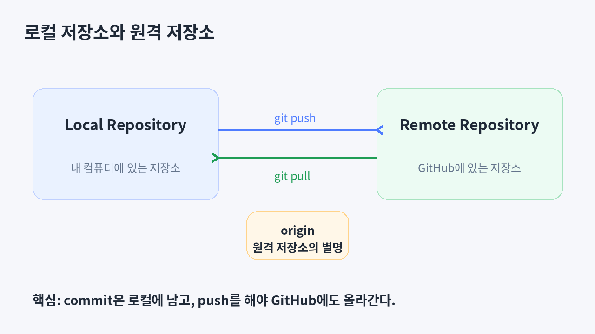
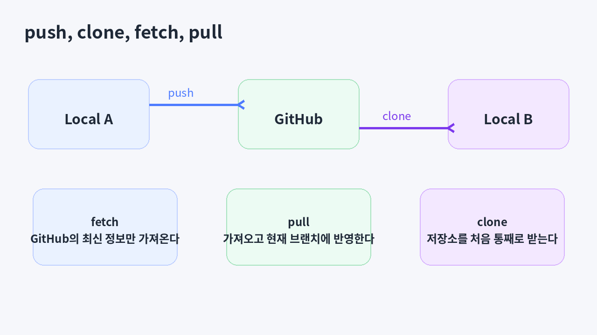
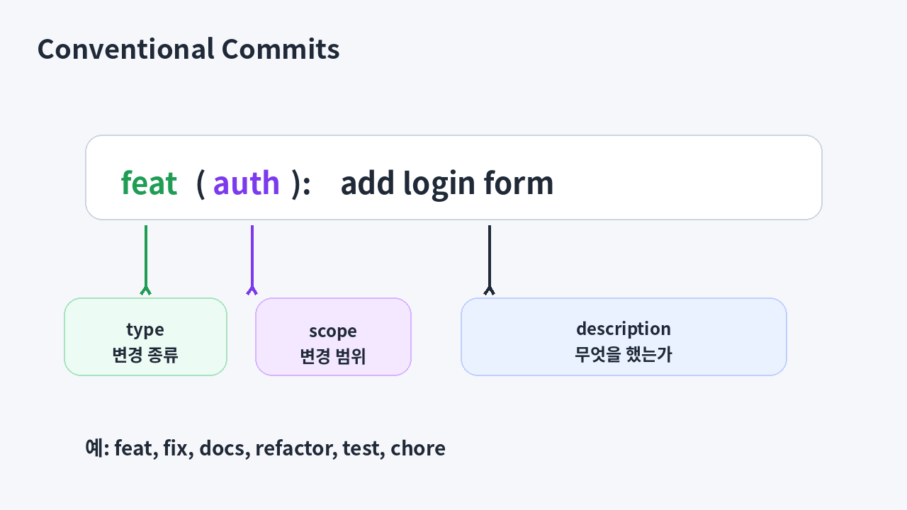
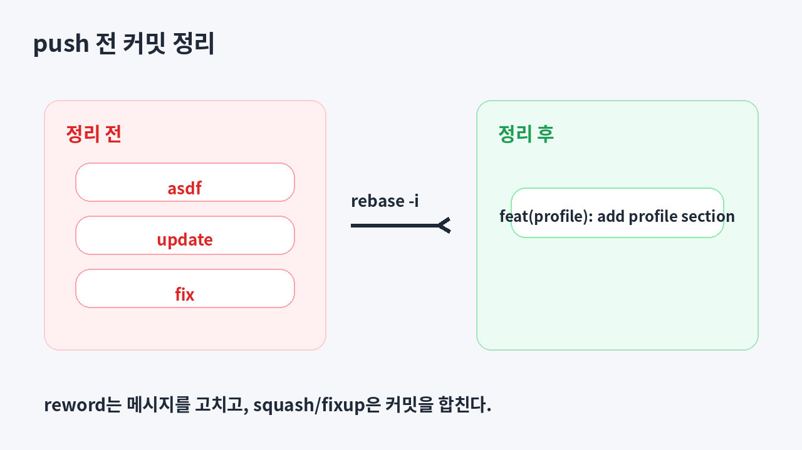
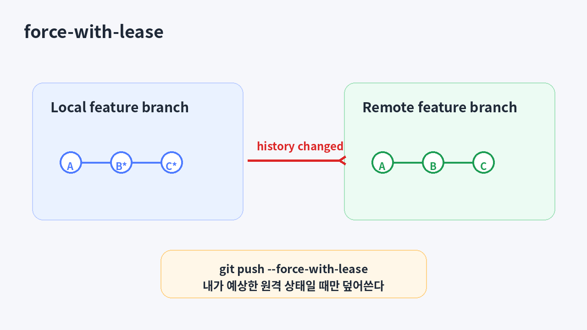
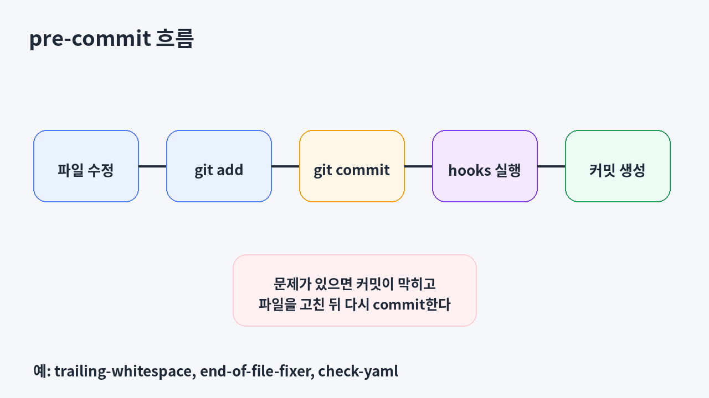

# 4주차

## 목표
- [ ] GitHub CLI를 사용해 GitHub에 로그인할 수 있다.
- [ ] 로컬 저장소와 원격 저장소의 차이를 설명할 수 있다.
- [ ] `git remote`, `git push`, `git clone`, `git fetch`, `git pull`의 역할을 설명할 수 있다.
- [ ] Conventional Commits 형식으로 커밋 메시지를 작성할 수 있다.
- [ ] `git rebase -i`를 사용해 push 전에 커밋 기록을 정리할 수 있다.
- [ ] 이미 push한 브랜치를 정리한 뒤 `git push --force-with-lease`를 사용할 수 있다.
- [ ] `pre-commit`을 설치하고 커밋 전에 자동 검사를 실행할 수 있다.

## 목차
1. 3주차 복습과 4주차 흐름
2. GitHub CLI로 로그인하기
3. 로컬 저장소와 원격 저장소
4. 첫 push와 clone
5. `fetch`와 `pull`
6. 커밋 메시지 정리: Conventional Commits
7. push 전 커밋 정리: `rebase -i`
8. 이미 push한 브랜치를 다시 올리기: `--force-with-lease`
9. 커밋 전에 자동 검사하기: `pre-commit`
10. 정리 및 과제 안내

---

## 1. 3주차 복습과 4주차 흐름
3주차에는 브랜치를 만들고, 브랜치에서 작업하고, merge conflict를 직접 해결하는 법을 배웠다.

```bash
git switch -c feature-readme
git merge feature-readme
git merge --abort
git stash
git stash pop
```

3주차까지는 대부분의 작업이 **내 컴퓨터 안의 Git 저장소**에서만 일어났다.  
4주차부터는 이 저장소를 GitHub와 연결하고, 다른 사람에게 보여주기 전에 커밋 기록도 한 번 정리해본다.

오늘은 다음 흐름을 연습한다.

> GitHub에 로그인한다 → 원격 저장소를 연결한다 → push한다 → commit message convention을 정한다 → `rebase -i`로 정리한다 → `pre-commit`으로 커밋 전에 자동 검사를 실행한다.

---

## 2. GitHub CLI로 로그인하기
GitHub에 코드를 올리려면 GitHub 계정 인증이 필요하다.  
이번 강의에서는 토큰을 직접 만들지 않고 [GitHub CLI](https://cli.github.com/)를 사용해서 로그인한다.

### 2.1 GitHub CLI 설치 확인
먼저 GitHub CLI가 설치되어 있는지 확인해보자.

```bash
gh --version
```

설치되어 있지 않다면 [GitHub CLI 공식 웹사이트](https://cli.github.com/)에서 설치할 수 있다.

---

### 2.2 GitHub 로그인하기
```bash
gh auth login
```

로그인 과정에서 다음과 같이 선택한다.

- GitHub.com
- HTTPS
- Login with a web browser

브라우저가 열리면 안내에 따라 로그인한다.

로그인이 끝났으면 현재 상태를 확인한다.

```bash
gh auth status
```

정상적으로 로그인되어 있으면 현재 로그인한 계정 정보가 출력된다.

> 만약 `git push`를 할 때 다시 인증을 요구한다면 `gh auth setup-git`을 실행해볼 수 있다.

---

## 3. 로컬 저장소와 원격 저장소
지금까지 만든 저장소는 내 컴퓨터 안에만 있었다.  
이 저장소를 GitHub에 올리면 GitHub 쪽에도 저장소가 생기고, 우리는 두 저장소를 연결해서 사용할 수 있다.



- 로컬 저장소(Local Repository): 내 컴퓨터에 있는 저장소
- 원격 저장소(Remote Repository): GitHub에 있는 저장소
- `origin`: 보통 기본 원격 저장소에 붙이는 이름

### 핵심
- `commit`은 로컬 저장소에 남는다.
- `push`를 해야 GitHub에도 올라간다.

---

### 3.1 오늘 실습 준비
오늘도 흐름을 명확하게 보기 위해 새 저장소에서 진행한다.

```bash
mkdir git-practice-week4
cd git-practice-week4
git init

echo "# Git Practice Week4" > README.md
git add README.md
git commit -m "Add README.md file"
```

그리고 GitHub 웹사이트에서 `git-practice-week4`라는 이름의 **빈 저장소**를 하나 만든다.  
이때 README, `.gitignore`, license는 추가하지 않는다.

---

### 3.2 원격 저장소 연결하기
GitHub에서 방금 만든 저장소의 URL을 복사한 뒤, 로컬 저장소와 연결한다.

```bash
git remote add origin <GitHub 저장소 URL>
git remote -v
```

`git remote -v`를 실행하면 `origin`이라는 이름과 함께 GitHub 저장소 URL이 보인다.

### 한 줄 요약
- `git remote add origin <URL>`: 이 로컬 저장소가 연결할 원격 저장소를 등록한다.
- `git remote -v`: 현재 연결된 원격 저장소를 확인한다.

---

## 4. 첫 push와 clone
이제 로컬 저장소의 커밋을 GitHub에 올려보자.

### 4.1 첫 push
지금 내가 서 있는 브랜치를 원격 저장소에 올린다.

```bash
git branch
git push -u origin HEAD
```

처음 push할 때는 `-u` 옵션을 함께 사용한다.  
이 옵션을 주면 현재 로컬 브랜치와 같은 이름의 원격 브랜치를 연결해둔다.

이후부터는 같은 브랜치에서 간단히 다음처럼 사용할 수 있다.

```bash
git push
```

### `git push`를 정확히 보기
보통은 `git push -u origin HEAD`처럼 짧게 쓰지만, `git push`는 사실 로컬의 어떤 ref를 원격의 어떤 ref로 보낼지 지정할 수 있다.

기본 구조는 다음과 같다.

```bash
git push <remote> <src>:<dst>
```

- `<remote>`: 보낼 원격 저장소. 보통 `origin`
- `<src>`: 내 로컬에서 보낼 대상. 예: `HEAD`, 로컬 브랜치 이름
- `<dst>`: 원격에서 업데이트할 브랜치 이름

예를 들어 현재 브랜치를 원격의 `feature/login` 브랜치로 보내려면 다음처럼 쓸 수 있다.

```bash
git push origin HEAD:feature/login
```

의미는 다음과 같다.

```text
현재 브랜치의 최신 커밋
→ origin 원격 저장소의 feature/login 브랜치
```

현재 브랜치를 원격에 같은 이름으로 올릴 때는 아래처럼 줄여 쓸 수 있다.

```bash
git push origin HEAD
```

처음 올리면서 upstream까지 연결하려면 보통 이렇게 쓴다.

```bash
git push -u origin HEAD
```

이 명령은 로컬의 `feature/login` ref를 원격의 `feature/login` ref로 push한다.

```bash
git push origin feature/login
```

### 한 줄 요약
- `git push origin HEAD:feature/login`: 현재 브랜치를 원격 `feature/login`으로 보낸다.
- `git push origin HEAD`: 현재 브랜치를 원격의 같은 이름 브랜치로 보낸다.
- `git push -u origin HEAD`: 현재 브랜치를 올리고 앞으로의 push/pull 연결도 설정한다.

---

### 4.2 다른 위치에 저장소 복제하기: `clone`
원격 저장소를 다른 위치에 처음 받아올 때는 `git clone`을 사용한다.

```bash
cd ..
git clone <GitHub 저장소 URL> git-practice-week4-clone
cd git-practice-week4-clone
```

`clone`은 저장소의 파일뿐 아니라 커밋 기록과 브랜치 정보까지 함께 가져온다.



---

## 5. `fetch`와 `pull`
`clone`은 저장소를 처음 받을 때 사용한다.  
이미 받아온 저장소에서 GitHub의 최신 내용을 확인하거나 가져오고 싶을 때는 `fetch`나 `pull`을 사용한다.

이 파트에서 중요한 건 `fetch`와 `pull`이 같지 않다는 점이다.

```text
git fetch
= 원격 저장소의 최신 상태를 가져와서 remote-tracking branch를 업데이트한다.

git pull
= git fetch를 한 뒤, 가져온 브랜치를 현재 브랜치에 merge한다.
```

---

### 5.1 remote-tracking branch
원격 저장소를 연결하면 Git은 원격 브랜치의 상태를 로컬 저장소 안에 기억해둔다.

예를 들어 GitHub의 `main` 브랜치는 내 로컬에서 보통 이렇게 보인다.

```text
origin/main
```

`origin/main`은 내가 직접 작업하는 로컬 브랜치가 아니다.  
Git이 “내가 마지막으로 확인한 원격 main의 위치”를 기억해두는 remote-tracking branch라고 보면 된다.

```text
main         = 내가 직접 작업하는 로컬 브랜치
origin/main  = Git이 기억하는 원격 main의 최신 위치
```

---

### 5.2 원본 저장소에서 새 커밋 만들기
먼저 원래 저장소로 돌아가서 새 커밋을 만들고 push한다.

```bash
cd ../git-practice-week4

echo "remote update" > REMOTE.md
git add REMOTE.md
git commit -m "docs: add remote update file"
git push
```

---

### 5.3 clone한 저장소에서 최신 정보 가져오기: `fetch`
이제 clone한 저장소로 이동한다.

```bash
cd ../git-practice-week4-clone
git fetch
git branch -r
git log --oneline --decorate --all
```

`git fetch`는 원격 저장소의 최신 정보를 가져와서 `origin/main` 같은 remote-tracking branch를 업데이트한다.  
하지만 현재 내가 작업 중인 로컬 브랜치나 파일은 바로 바꾸지 않는다.

### 여기까지 확인
- `origin/main`이 원격의 최신 상태를 가리킨다.
- 내 로컬 `main`과 working directory는 아직 바로 바뀌지 않았다.
- `fetch`는 가져오기만 하고, 현재 브랜치에 합치지는 않는다.

---

### 5.4 최신 내용을 현재 브랜치에 반영하기: `pull`
```bash
git pull
ls
```

`git pull`은 내부적으로 먼저 `git fetch`를 실행하고, fetch된 브랜치를 현재 브랜치에 `git merge`한다.  
즉 초보자용으로는 아래처럼 이해하면 된다.

```text
git pull = git fetch + git merge
```

그래서 `git pull` 후에는 `REMOTE.md` 파일이 현재 브랜치에 반영되어 보일 것이다.

---

### 5.5 `git pull --rebase`
`pull`을 할 때 merge 대신 rebase 방식으로 반영할 수도 있다.

```bash
git pull --rebase
```

이 경우에는 아래처럼 이해하면 된다.

```text
git pull --rebase = git fetch + git rebase
```

4주차에서는 깊게 들어가지 않고, `pull`은 가져온 내용을 현재 브랜치에 반영하는 명령이고, `--rebase`를 붙이면 merge 대신 rebase 방식으로 반영할 수 있다는 정도만 기억하면 된다.

### 한 줄 요약
- `git clone`: 저장소를 처음 통째로 받아온다.
- `git fetch`: 원격 상태를 가져와 remote-tracking branch를 업데이트한다. 현재 브랜치는 바로 바꾸지 않는다.
- `git pull`: `fetch` 후 현재 브랜치에 `merge`한다.
- `git pull --rebase`: `fetch` 후 현재 브랜치를 가져온 브랜치 위로 `rebase`한다.

---

## 6. 커밋 메시지 정리: Conventional Commits
이제부터는 커밋을 혼자만 보는 것이 아니라 GitHub에 올리게 된다.  
그래서 커밋 메시지도 남이 읽기 쉽게 맞추는 것이 좋다.

[Conventional Commits](https://www.conventionalcommits.org/en/v1.0.0/)는 커밋 메시지에 일정한 형식을 주는 규칙이다.



### 기본 형식
```text
<type>[optional scope]: <description>
```

### 자주 쓰는 type
- `feat`: 새로운 기능 추가
- `fix`: 버그 수정
- `docs`: 문서 수정
- `style`: 코드 의미에 영향이 없는 스타일 수정
- `refactor`: 동작은 그대로지만 코드 구조를 개선
- `test`: 테스트 추가/수정
- `chore`: 빌드, 설정, 기타 작업

### 예시
```text
feat: add profile page
fix(auth): handle expired token
docs: update README
refactor: split user service
test: add login test
chore: update dependencies
```

### 왜 필요한가?
커밋 메시지를 일정한 형식으로 쓰면 `git log`만 봐도 어떤 종류의 작업이 있었는지 빠르게 알 수 있다.  
프로젝트에서 여러 사람이 함께 작업할수록 이런 규칙의 효과가 커진다.

---

## 7. push 전 커밋 정리: `rebase -i`
실제로 작업하다 보면 커밋이 항상 예쁘게 만들어지지는 않는다.

예를 들어 이런 커밋이 쌓일 수 있다.

```text
asdf
update
fix
```

push하기 전이라면 이런 커밋들을 정리하고 올리는 것이 좋다.



---

### 7.1 정리할 커밋 만들기
먼저 새 브랜치를 하나 만들고 일부러 지저분한 커밋을 만들어보자.

```bash
cd ../git-practice-week4
git switch -c feature-profile

echo "" >> README.md
echo "## Profile" >> README.md
git add README.md
git commit -m "asdf"

echo "profile page todo" > profile.txt
git add profile.txt
git commit -m "update"

echo "fix typo" >> profile.txt
git add profile.txt
git commit -m "fix"

git log --oneline
```

---

### 7.2 feature 브랜치를 먼저 push하기
나중에 `--force-with-lease`를 보기 위해, 일단 현재 브랜치를 먼저 GitHub에 올려둔다.

```bash
git push -u origin HEAD
```

---

### 7.3 interactive rebase 실행하기
최근 3개의 커밋을 정리해보자.

```bash
git rebase -i HEAD~3
```

에디터가 열리면 다음과 비슷한 내용이 보인다.

```text
pick <hash1> asdf
pick <hash2> update
pick <hash3> fix
```

예를 들어 다음처럼 바꿀 수 있다.

```text
reword <hash1> asdf
squash <hash2> update
fixup <hash3> fix
```

### 각 명령어의 의미
- `pick`: 그대로 둔다.
- `reword`: 커밋 내용은 그대로 두고 메시지만 고친다.
- `squash`: 이전 커밋과 합치고 메시지도 같이 정리한다.
- `fixup`: 이전 커밋과 합치되, 현재 커밋 메시지는 버린다.

최종 커밋 메시지는 Conventional Commits 형식으로 정리한다.

```text
feat(profile): add profile section
```

정리가 끝났으면 로그를 다시 확인한다.

```bash
git log --oneline
```

### 핵심
`rebase -i`는 **남에게 보여주기 전 내 브랜치의 커밋 기록을 정리하는 용도**로 생각하면 된다.

---

## 8. 이미 push한 브랜치를 다시 올리기: `--force-with-lease`
방금은 `feature-profile` 브랜치를 먼저 push한 뒤 `rebase -i`로 커밋 기록을 바꿨다.  
이제 로컬의 커밋 기록과 GitHub의 커밋 기록이 서로 달라졌다.

일반 `git push`를 실행하면 거부될 수 있다.

```bash
git push
```

이럴 때는 다음 명령어를 사용한다.

```bash
git push --force-with-lease
```



### 왜 그냥 `--force`가 아니라 `--force-with-lease`인가?
`--force-with-lease`는 원격 브랜치가 내가 예상한 상태일 때만 덮어쓴다.  
즉, 내가 마지막으로 본 이후 다른 사람이 원격 브랜치를 바꿨다면 무작정 덮어쓰지 않게 도와준다.

### 주의할 점
- `rebase -i`는 이미 공유된 브랜치에서 막 사용하면 다른 사람을 헷갈리게 할 수 있다.
- 이번 실습에서는 **내가 혼자 쓰는 feature 브랜치**에서만 사용한다고 생각하면 된다.

---

## 9. 커밋 전에 자동 검사하기: `pre-commit`
지금까지는 커밋을 직접 확인하고 만들었다.  
하지만 프로젝트가 커지면 사소한 실수를 반복해서 잡는 것도 귀찮아진다.

이럴 때 Git hook을 사용하면 특정 시점에 자동으로 명령어를 실행할 수 있다.  
[pre-commit](https://pre-commit.com/)은 이런 hook을 쉽게 관리할 수 있게 도와주는 도구이다.



---

### 9.1 `pre-commit` 설치하기
먼저 `pre-commit`을 설치한다.

```bash
python -m pip install pre-commit
```

설치되었는지 확인한다.

```bash
pre-commit --version
```

---

### 9.2 설정 파일 만들기
프로젝트 루트에 `.pre-commit-config.yaml` 파일을 만든다.

```yaml
repos:
  - repo: https://github.com/pre-commit/pre-commit-hooks
    rev: v6.0.0
    hooks:
      - id: trailing-whitespace
      - id: end-of-file-fixer
      - id: check-yaml
```

설정 파일을 만든 뒤 hook을 설치한다.

```bash
pre-commit install
```

---

### 9.3 전체 파일에 대해 한 번 실행해보기
```bash
pre-commit run --all-files
```

처음 실행할 때는 hook을 내려받느라 시간이 조금 걸릴 수 있다.

---

### 9.4 커밋할 때 자동 검사 확인하기
일부러 공백이 붙은 파일을 하나 만들어보자.

```bash
printf "line with trailing spaces   \n" > sample.txt
git add sample.txt .pre-commit-config.yaml
git commit -m "chore: add pre-commit config"
```

처음 commit에서는 trailing whitespace hook이 파일을 수정하면서 commit이 실패할 수 있다.  
수정된 파일을 다시 add하고 commit한다.

```bash
git add sample.txt .pre-commit-config.yaml
git commit -m "chore: add pre-commit config"
```

### commit message도 검사할 수 있을까?
이번 실습에서는 파일 검사만 해본다.  
하지만 Git에는 `commit-msg` hook도 있고, 이를 사용하면 Conventional Commits 형식처럼 커밋 메시지 규칙도 자동으로 검사할 수 있다.

---

## 10. 정리 및 과제 안내
오늘 배운 내용은 “로컬 작업을 GitHub에 올리고, 남에게 보여주기 전에 정리하는 방법”이다.

꼭 기억해야 할 것은 다음과 같다.

1. `commit`은 로컬에 남고, `push`를 해야 GitHub에도 올라간다.
2. `origin`은 보통 기본 원격 저장소의 이름이다.
3. `git push`는 `<src>:<dst>` 구조로 로컬 ref를 원격 ref로 보낼 수 있다.
4. 현재 브랜치를 원격의 같은 이름 브랜치로 올릴 때는 `git push -u origin HEAD`를 사용할 수 있다.
5. `clone`은 저장소를 처음 통째로 받을 때 사용한다.
6. `fetch`는 원격 상태를 `origin/main` 같은 remote-tracking branch에 가져오고, `pull`은 fetch 후 현재 브랜치에 merge한다.
7. `git pull --rebase`는 fetch 후 merge 대신 rebase 방식으로 반영한다.
8. 커밋 메시지는 남이 읽기 쉽게 작성하는 것이 좋다.
9. Conventional Commits를 사용하면 커밋 메시지 형식을 맞추기 쉽다.
10. `rebase -i`는 push 전에 내 브랜치의 커밋 기록을 정리할 때 유용하다.
11. 이미 push한 브랜치를 정리했다면 `git push --force-with-lease`가 필요할 수 있다.
12. `pre-commit`은 커밋 전에 자동 검사를 실행할 수 있다.

---

## 11. 명령어 요약
```bash
gh auth login
gh auth status

git remote add origin <GitHub 저장소 URL>
git remote -v

git push -u origin HEAD
git push origin HEAD:feature/login
git push

git clone <GitHub 저장소 URL>
git fetch
git pull
git pull --rebase

git switch -c feature-profile
git rebase -i HEAD~3
git push --force-with-lease

python -m pip install pre-commit
pre-commit install
pre-commit run --all-files
```

### 짧은 용도 정리
- `gh auth login`: GitHub CLI로 로그인
- `git remote add origin <URL>`: 원격 저장소 연결
- `git remote -v`: 연결된 원격 저장소 확인
- `git push -u origin HEAD`: 현재 브랜치를 원격의 같은 이름 브랜치로 올리면서 추적 관계 설정
- `git clone <URL>`: 원격 저장소를 새 폴더로 복제
- `git fetch`: 원격 상태를 가져와 `origin/main` 같은 remote-tracking branch 업데이트
- `git pull`: `fetch` 후 현재 브랜치에 `merge`로 반영
- `git pull --rebase`: `fetch` 후 현재 브랜치에 `rebase`로 반영
- `git rebase -i HEAD~n`: 최근 커밋 n개를 대화형으로 정리
- `git push --force-with-lease`: 원격 브랜치를 안전하게 강제 갱신
- `pre-commit install`: commit 전에 hook이 자동 실행되도록 설치
- `pre-commit run --all-files`: 전체 파일을 대상으로 hook 수동 실행

---

## 12. 과제 (Optional)
### 과제 1
GitHub에 새 저장소를 만들고, 로컬 저장소와 연결한 뒤 `main` 브랜치를 push해보자.

### 과제 2
새 feature 브랜치를 만들고 Conventional Commits 형식으로 커밋 3개를 만들어보자.

예시:
```text
feat: add profile page
docs: update README
fix: correct typo
```

### 과제 3
`git rebase -i HEAD~3`으로 커밋 메시지를 고치거나, 필요하면 커밋을 합쳐보자.

### 과제 4
이미 push한 feature 브랜치를 정리한 뒤 `git push --force-with-lease`로 다시 올려보자.

### 과제 5
`pre-commit`을 설치하고 `pre-commit run --all-files`를 실행해보자.
